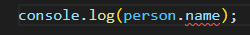
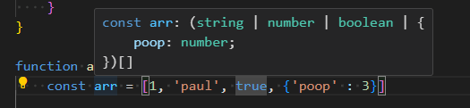
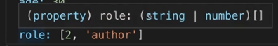
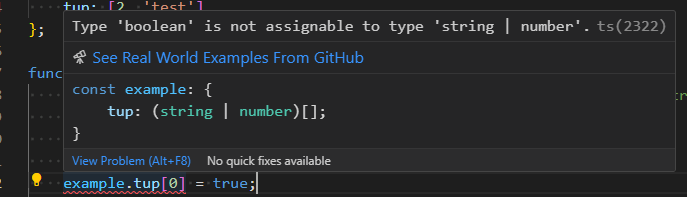

[Back](./../README.md)

# Core Types
## number
* Can be integers, floats, signed integers/floats, etc.

## string
* single, double, and backticks
```ts
// all of these are acceptable
// singles are preferred typically
const single: string = 'test';
const double: string = "test";
const backticks: string = `test`;
```

## boolean
* true/false
* Does **NOT** include "truthy"/"falsy" values

## object
* Any that are in Javascript as well as more specfic types.
* A generic object.
* Built-in type which is the most generic.
    * Want to get more specific than that.

```ts
// since this is just a generic object, this will be a bad idea
const person: object = {
    name: 'TheName',
    age:  24
}

// We will not be able to access this name
console.log(person.name);
```
As you can see here:



This caused an error with typescript because this is a generic object.

A better way to accomplish this is to use curly braces:
```ts
// will still throw errors, but we are on track to fixing this
const goodPerson: {} = {
    name: 'test',
    age:  24
}
```
This is still a generic object type, but now it is customizable so that way we can build a correct type.

Below, here is how you would make a custom type:
```ts
// Specifying which variables it should have in the first set of curly braces
const goodPerson: {
    name: string,
    age:  number
} = {
    name: 'test',
    age:  24
}

// these will output correctly now
console.log(goodPerson.name + ': ' + goodPerson.age);
```
Here is the result after running this code:
```
test: 24
```
Note that we have to specify all of the members for const variables:
```ts
// this will lead to errors
const badGoodPerson: {
    name: string,
    age:  number
} = {
    name: 'test'
}
```
Also, we can just let type-inference do its work for this situation:
```ts
const betterPerson = {
    name: 'better',
    age: 25
}
```

## Arrays
* Can have mixed data.
```ts
// Here, this array can host different types of objects/data types
function arraysExample(): void {
    const arr = [1, 'paul', true, {'poop' : 3}];

    for (let num: number = 0; num < arr.length; num++) {
        console.log('arr[' + num + ']: ' + arr[num]);
    }

    //... The rest of the function
```
When we hover over 'arr', here is how Visual Studio Code displays the type:



***Note***: This is a **union** type.

While the example above is fine since typescript was able to infer the type, the one below will cause errors:
* **Note** that this is in the same function as the example above.
```ts
    let strArray: string[];
    strArray = ['test', 3];
```


* This also means that this ***NEEDS*** to be an array as well.
    * An array that only includes string values.

```ts
    let strArray: string[];
    strArray = ['test1', 'test2', 'milk kell'];
    for (const element of strArray) {
        console.log(element);
    }
```
Above is a valid loop iterating over an array of strings.

Here is the output of that code:
```
test1
test2
milk kell
```

Note that we can also perform functions on each element while iterating:
```ts
    for (const element of strArray) {
        console.log(element.toUpperCase());
    }
```
```
TEST1
TEST2
MILK KELL
```

## Tuples
Fixed-length and Fixed-type array
* Also fixed type as well!


* Typescript knows that this is an array with a string and a number type.
* It does ***NOT*** know that there are only two elements.

Here is an example of an object:
```ts
const example = {
    tup: [2, 'test']
};
```
We expect that the tuple only has a number and a string in the array.
```ts
// Although we want to keep this as a tuple with integer in [0] and string
// in [1], typescript still allows us to do this:
example.tup.push('uh oh');
example.tup[1] = 15;
console.log(example);
```
However, as we see here, we can make it 3 elements and change the elements in this array to become a string or integer.

The only thing we cannot do (of course) is give it a boolean or something:


# Language Syntax (with examples)
## Symbols
### ===
Checks if two variables are "exactly" equal to each other.
* Checks value and data type.
```ts
// will only return true if 'typeof val' returns a string
function isString(val: any): boolean {
    return (typeof val === 'string');
}

// will only return true if same type and data
function isExactMatch(val1: any, val2: any): boolean {
    return (val1 === val2);
}
```

## Keywords
### typeof
Used to get the type of a certain value.
* Returns a string:
```ts
function typeofExample() {
    let num: number = 1;
    let str: string = 'test';
    let bule: boolean = false;
    const typeofPrintDef: string = 'typeof operator print: ';

    // note that typeof returns a string
    console.log(typeofPrintDef + (typeof num));
    console.log(typeofPrintDef + (typeof str));
    console.log(typeofPrintDef + (typeof bule));
}
```
This function will print out:
```
typeof operator print: number
typeof operator print: string
typeof operator print: boolean
```
Normally, this typeof operator is used to check types in javascript:
```ts
// printing out result no matter what, but only adding by 5 if num is a number
if (typeof num === 'number') {
    num += 5;
}
console.log('result=' + num);
```

[Back](./../README.md)